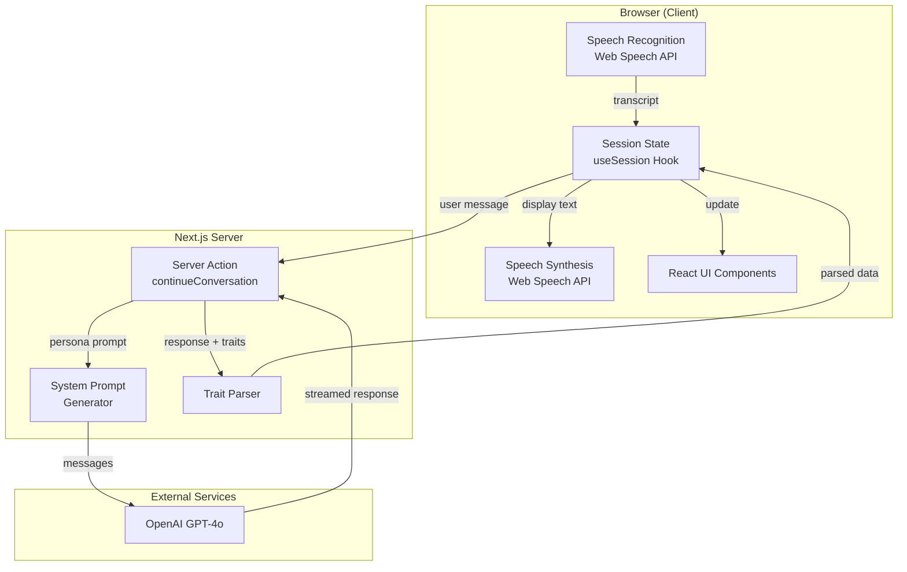

# AV Broker Trainer Architecture

## Project Overview

AV Broker Trainer is a voice-based training simulator for insurance brokers. It enables real-time voice conversations with AI-powered virtual customers, displaying the customer's Big Five (OCEAN) psychographic profile as personality traits emerge during the interaction.

## Design Principles

1. **Voice-First UX**: Primary interaction via voice, making training feel like a real customer call
2. **Progressive Disclosure**: Psychographic traits are revealed gradually as they manifest in conversation
3. **Stateless Simplicity**: No database - each session is independent for MVP simplicity
4. **Browser-Native**: Uses Web Speech API for voice, minimizing external dependencies

## System Architecture



## Tech Stack

| Layer | Technology | Purpose |
|-------|------------|---------|
| Framework | Next.js 15.1.3 (App Router) | SSR, Server Actions, Routing |
| Language | TypeScript (strict) | Type safety |
| Styling | Tailwind CSS 3.4 | Utility-first CSS |
| UI Components | shadcn/ui (custom) | Accessible, customizable components |
| AI Integration | Vercel AI SDK 4.x | Streaming LLM responses |
| LLM | OpenAI GPT-4o | Virtual customer conversations |
| Voice STT | Web Speech API | Browser-native speech recognition |
| Voice TTS | Web Speech API | Browser-native speech synthesis |

## File Structure

```
av-broker-trainer/
├── ARCHITECTURE.md              # This file
├── package.json                 # Dependencies and scripts
├── tsconfig.json               # TypeScript configuration
├── tailwind.config.ts          # Tailwind CSS configuration
├── next.config.ts              # Next.js configuration
├── .env.local                  # Environment variables (OPENAI_API_KEY)
├── src/
│   ├── app/
│   │   ├── globals.css         # Global styles + CSS variables
│   │   ├── layout.tsx          # Root layout with metadata
│   │   ├── page.tsx            # Home page (landing)
│   │   └── session/
│   │       └── page.tsx        # Training session page (main app)
│   ├── components/
│   │   ├── ui/                 # shadcn/ui base components
│   │   │   ├── avatar.tsx
│   │   │   ├── badge.tsx
│   │   │   ├── button.tsx
│   │   │   ├── card.tsx
│   │   │   ├── progress.tsx
│   │   │   └── scroll-area.tsx
│   │   └── session/            # Session-specific components
│   │       ├── VoiceControl.tsx       # Mic button + status
│   │       ├── ConversationPanel.tsx  # Chat transcript
│   │       ├── PsychographicPanel.tsx # OCEAN traits display
│   │       ├── PersonaCard.tsx        # Customer info card
│   │       └── SessionControls.tsx    # Start/end buttons
│   ├── lib/
│   │   ├── utils.ts            # cn() helper for classnames
│   │   └── ai/
│   │       ├── personas.ts     # 5 persona definitions
│   │       └── system-prompts.ts # AI prompt generation
│   ├── hooks/
│   │   ├── useVoiceInput.ts    # Speech recognition wrapper
│   │   ├── useVoiceSynthesis.ts # Speech synthesis wrapper
│   │   └── useSession.ts       # Session state management
│   ├── actions/
│   │   └── conversation.ts     # Server action for AI chat
│   └── types/
│       └── index.ts            # TypeScript type definitions
```

## Customer Personas

Five distinct Italian personas with predefined Big Five trait profiles:

| ID | Name | O | C | E | A | N | Archetype |
|----|------|---|---|---|---|---|-----------|
| analytical-alex | Alessandro Bianchi | 0.75 | 0.85 | 0.35 | 0.55 | 0.45 | IT Manager, data-driven |
| friendly-fiona | Francesca Rossi | 0.55 | 0.50 | 0.85 | 0.80 | 0.30 | Shop owner, relationship-focused |
| skeptical-sam | Salvatore Greco | 0.25 | 0.80 | 0.30 | 0.25 | 0.75 | Accountant, past bad experience |
| decisive-dana | Daniela Martini | 0.55 | 0.60 | 0.75 | 0.45 | 0.35 | Sales director, time-pressed |
| cautious-carlo | Carlo Ferretti | 0.30 | 0.70 | 0.35 | 0.75 | 0.80 | Retired teacher, needs reassurance |

## Data Flow

### Conversation Flow

1. **User speaks** → SpeechRecognition captures audio and converts to text
2. **Transcript captured** → Text added to conversation history via `useSession`
3. **Server action called** → `continueConversation` sends history + persona context to GPT-4o
4. **AI responds** → GPT-4o generates response as the persona character
5. **Response parsed** → Extract spoken text and OCEAN trait signals from response
6. **UI updated** → Conversation panel shows new message, trait panel updates
7. **TTS speaks** → SpeechSynthesis reads the response aloud

### AI Response Format

The AI is instructed to append structured JSON after its natural response:

```
[Natural conversational response in Italian as the persona]

---TRAITS---
{"traits":{"O":0.7,"C":0.8},"signals":["Comunicazione diretta","Ha chiesto dati specifici"]}
```

## Key Components

### VoiceControl (`src/components/session/VoiceControl.tsx`)
- Push-to-talk microphone button with visual pulse animation
- Shows listening/processing/speaking states
- Handles browser compatibility warnings

### ConversationPanel (`src/components/session/ConversationPanel.tsx`)
- Scrollable chat transcript with auto-scroll
- Shows user (broker) and assistant (customer) messages
- Displays interim transcript while user is speaking
- Shows streaming AI response with typing indicator

### PsychographicPanel (`src/components/session/PsychographicPanel.tsx`)
- Five progress bars for OCEAN traits (0-100%)
- Unknown traits show animated placeholder
- Displays recent behavioral signals
- Color-coded by trait type

### useSession Hook (`src/hooks/useSession.ts`)
- Manages session state (idle, active, ended)
- Handles persona selection (random)
- Tracks conversation history
- Merges and accumulates revealed traits

## Environment Variables

| Variable | Description | Required |
|----------|-------------|----------|
| `OPENAI_API_KEY` | OpenAI API key for GPT-4o | Yes |

## Browser Compatibility

Web Speech API support:
- **Chrome/Edge**: Full support (recommended)
- **Safari**: Partial support
- **Firefox**: Limited support (may require flags)

The app displays a compatibility warning if Speech API is unavailable.

## Getting Started

```bash
# Install dependencies
npm install

# Set up environment
cp .env.local.example .env.local
# Add your OPENAI_API_KEY

# Run development server
npm run dev

# Build for production
npm run build
npm start
```

## ADR Log

| Date | Decision | Context | Consequences |
|------|----------|---------|--------------|
| 2025-01-07 | Use Web Speech API | Free, browser-native, sufficient for MVP | Limited browser support, less accurate than cloud APIs |
| 2025-01-07 | Use GPT-4o | High quality roleplay, Vercel AI SDK compatible | API costs, requires OpenAI account |
| 2025-01-07 | Big Five (OCEAN) model | Scientific standard, well-documented | More abstract than sales-specific frameworks |
| 2025-01-07 | Stateless MVP | Faster development, simpler architecture | No session history, analytics, or progress tracking |
| 2025-01-07 | Italian personas | Target market is Italian insurance brokers | Prompts and UI in Italian |
| 2025-01-07 | Trait extraction via JSON markers | Reliable parsing, avoids regex on natural language | Slightly more complex prompting |
