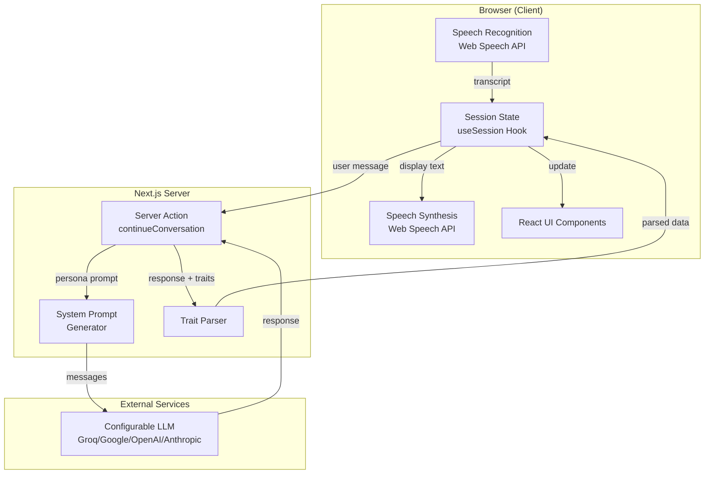

# AV Broker Trainer Architecture

## Project Overview

AV Broker Trainer is a voice-based training simulator for insurance brokers. It enables real-time voice conversations with AI-powered virtual customers, displaying the customer's Big Five (OCEAN) psychographic profile as personality traits emerge during the interaction.

## Design Principles

1. **Voice-First UX**: Primary interaction via voice, making training feel like a real customer call
2. **Progressive Disclosure**: Psychographic traits are revealed gradually as they manifest in conversation
3. **Stateless Simplicity**: No database - each session is independent for MVP simplicity
4. **Browser-Native**: Uses Web Speech API for voice, minimizing external dependencies

## System Architecture



## Tech Stack

| Layer | Technology | Purpose |
|-------|------------|---------|
| Framework | Next.js 16.1.1 (App Router) | SSR, Server Actions, Routing |
| Language | TypeScript 5.7 (strict) | Type safety |
| Styling | Tailwind CSS 3.4 | Utility-first CSS |
| UI Components | shadcn/ui (custom) | Accessible, customizable components |
| AI Integration | Vercel AI SDK 6.x | LLM responses via generateText |
| LLM | Configurable (Groq/Google/OpenAI/Anthropic) | Virtual customer conversations |
| Voice STT | Web Speech API | Browser-native speech recognition |
| Voice TTS | Web Speech API | Browser-native speech synthesis |
| Linting | ESLint 9 (flat config) | Code quality enforcement |

## File Structure

```
av-broker-trainer/
├── ARCHITECTURE.md              # This file
├── package.json                 # Dependencies and scripts
├── tsconfig.json               # TypeScript configuration
├── tailwind.config.ts          # Tailwind CSS configuration
├── next.config.ts              # Next.js configuration
├── eslint.config.mjs           # ESLint flat configuration
├── .env.local                  # Environment variables (AI_PROVIDER, API keys)
├── scripts/
│   ├── test-conversation.ts    # Conversation flow test suite
│   └── test-edge-cases.ts      # Edge case test suite
├── src/
│   ├── app/
│   │   ├── globals.css         # Global styles + CSS variables
│   │   ├── layout.tsx          # Root layout with metadata
│   │   ├── page.tsx            # Home page (landing)
│   │   └── session/
│   │       └── page.tsx        # Training session page (main app)
│   ├── components/
│   │   ├── ui/                 # shadcn/ui base components
│   │   │   ├── avatar.tsx
│   │   │   ├── badge.tsx
│   │   │   ├── button.tsx
│   │   │   ├── card.tsx
│   │   │   ├── progress.tsx
│   │   │   └── scroll-area.tsx
│   │   └── session/            # Session-specific components
│   │       ├── VoiceControl.tsx       # Mic button + status
│   │       ├── ConversationPanel.tsx  # Chat transcript
│   │       ├── PsychographicPanel.tsx # OCEAN traits display
│   │       ├── PersonaCard.tsx        # Customer info card
│   │       └── SessionControls.tsx    # Start/end buttons
│   ├── lib/
│   │   ├── utils.ts            # cn() helper for classnames
│   │   └── ai/
│   │       ├── provider.ts     # Multi-provider abstraction (Groq/Google/OpenAI/Anthropic)
│   │       ├── personas.ts     # 5 persona definitions
│   │       └── system-prompts.ts # AI prompt generation
│   ├── hooks/
│   │   ├── useVoiceInput.ts    # Speech recognition wrapper
│   │   ├── useVoiceSynthesis.ts # Speech synthesis wrapper
│   │   └── useSession.ts       # Session state management
│   ├── actions/
│   │   └── conversation.ts     # Server action for AI chat
│   └── types/
│       └── index.ts            # TypeScript type definitions
```

## Customer Personas

Five distinct Italian personas with predefined Big Five trait profiles:

| ID | Name | O | C | E | A | N | Archetype |
|----|------|---|---|---|---|---|-----------|
| analytical-alex | Alessandro Bianchi | 0.75 | 0.85 | 0.35 | 0.55 | 0.45 | IT Manager, data-driven |
| friendly-fiona | Francesca Rossi | 0.55 | 0.50 | 0.85 | 0.80 | 0.30 | Shop owner, relationship-focused |
| skeptical-sam | Salvatore Greco | 0.25 | 0.80 | 0.30 | 0.25 | 0.75 | Accountant, past bad experience |
| decisive-dana | Daniela Martini | 0.55 | 0.60 | 0.75 | 0.45 | 0.35 | Sales director, time-pressed |
| cautious-carlo | Carlo Ferretti | 0.30 | 0.70 | 0.35 | 0.75 | 0.80 | Retired teacher, needs reassurance |

## Data Flow

### Conversation Flow

1. **User speaks** → SpeechRecognition captures audio and converts to text
2. **Transcript captured** → Text added to conversation history via `useSession`
3. **Server action called** → `continueConversation` sends history + persona context to configured LLM
4. **AI responds** → LLM generates response as the persona character
5. **Response parsed** → Extract spoken text and OCEAN trait signals from response
6. **UI updated** → Conversation panel shows new message, trait panel updates
7. **TTS speaks** → SpeechSynthesis reads the response aloud

### AI Response Format

The AI is instructed to append structured JSON after its natural response:

```
[Natural conversational response in Italian as the persona]

---TRAITS---
{"traits":{"O":0.7,"C":0.8},"signals":["Comunicazione diretta","Ha chiesto dati specifici"]}
```

## UI/UX Design System

The application uses a distinctive, handcrafted design language that feels unique and purposeful.

### Design Philosophy

- **Typography-forward**: Instrument Serif for headings creates an editorial feel
- **Organic shapes**: Blob shapes and asymmetric elements add visual interest
- **Layered depth**: Multiple shadow layers and gradients create dimension
- **Crafted details**: Corner accents, stamps, and custom decorations
- **Italian-inspired palette**: Olive-to-emerald green (HSL 152) with warm terracotta/ochre accents
- **Hand-crafted feel**: Brushstroke underlines, staggered layouts, offset shadows
- **Asymmetric layouts**: Breaking typical grid patterns for more human, less AI-generated appearance

### Design Tokens (globals.css)

| Token | Purpose |
|-------|---------|
| `--primary` | Primary brand color (olive green, HSL 152 55% 26%) |
| `--accent` | Light green for backgrounds (HSL 152 25% 88%) |
| `--background` | Off-white with subtle warmth (HSL 80 8% 98%) |
| `--card` | Cream-tinted card surfaces (HSL 60 20% 99%) |
| `--muted` | Subdued backgrounds (HSL 80 12% 92%) |
| `--green-50` to `--green-700` | Extended green scale (olive to emerald) |
| `--warm-50` to `--warm-400` | Warm terracotta/ochre accents (Italian feel) |
| `--cream-50` to `--cream-200` | Cream tones for paper-like textures |

### Typography

| Font | Usage |
|------|-------|
| Instrument Serif | Headings, numbers, persona initials |
| Inter | Body text, UI elements, labels |

### Custom Utility Classes

| Class | Effect |
|-------|--------|
| `.paper-card` | Subtle gradient background with layered shadow |
| `.corner-accent` | L-shaped green accent in top-left corner |
| `.stamp` | Rotated badge with dashed inner border |
| `.blob` | Organic rounded shape (60%/40%/30%/70%) |
| `.number-marker` | Diamond-shaped step number |
| `.card-lifted` | Hover lift effect with shadow |
| `.shadow-stepped` | Offset shadow layers |
| `.ink-bleed` | Subtle text shadow for headings |
| `.trait-progress` | Custom progress bar with tick marks |
| `.message-user` | User message bubble with asymmetric corners |
| `.message-assistant` | Assistant message with left border accent |
| `.btn-lift` | Button hover lift with shadow |
| `.brushstroke` | Hand-painted underline effect with warm color |
| `.tile-border` | Italian tile pattern top border |
| `.card-organic` | Card with cream gradient and left accent border |
| `.number-handwritten` | Large faded background numbers (serif) |
| `.badge-vintage` | Warm-toned badge with ochre accents |
| `.dash-accent` | Diagonal decorative dash element |
| `.quote-float` | Floating quotation mark decoration |
| `.stripe-accent` | Diagonal stripe pattern overlay |
| `.shadow-offset` | Offset shadow for depth effect |
| `.divider-squiggle` | SVG squiggle line divider |
| `.lift-warm` | Hover lift with warm glow shadow |
| `.text-gradient-warm` | Green to warm gradient text |
| `.notch-corner` | Clipped corner with accent fill |

### Animations

| Animation | Usage |
|-----------|-------|
| `pulse-organic` | Morphing blob shape animation |
| `ripple-out` | Expanding ripple for mic button |
| `float-gentle` | Subtle floating motion |
| `shimmer-sweep` | Loading skeleton shimmer |
| `blink-cursor` | Typing cursor animation |
| `mic-pulse` | Red glow pulse when recording |

### Component Styling Patterns

- **Cards**: `paper-card` with layered shadows, `corner-accent` for emphasis
- **Buttons**: Primary with lift animation, active scale feedback
- **Headers**: Sticky with backdrop blur, gradient icon containers
- **Messages**: Asymmetric rounded corners, initials avatars
- **Progress bars**: Custom trait bars with tick marks
- **Status indicators**: Pulsing dots with appropriate colors
- **Decorative elements**: Blobs, gradients, corner decorations

## Key Components

### VoiceControl (`src/components/session/VoiceControl.tsx`)
- Horizontal layout with mic button, status area, and stop button
- Dynamic color bar at top (red when recording, green when speaking, muted when idle)
- Triple ripple animation when recording
- Mic button with glow effect and scale animation
- Status text with icon showing current state
- Keyboard hint for push-to-talk (K key)

### Keyboard Controls

| Key | Action |
|-----|--------|
| `K` (hold) | Push-to-talk: hold to capture voice, release to send |

The keyboard listener is active only during an active session and ignores keypresses in input fields.

### ConversationPanel (`src/components/session/ConversationPanel.tsx`)
- Gradient header with message counter
- Asymmetric message bubbles (`.message-user`, `.message-assistant`)
- Serif initials avatar for assistant, icon avatar for user
- Message numbering on hover
- Dashed border style for interim (listening) state
- Blinking cursor animation for streaming responses

### PsychographicPanel (`src/components/session/PsychographicPanel.tsx`)
- Gradient icon containers with trait-specific colors (violet, emerald, amber, rose, red)
- 5-dot progress indicator in header showing revealed traits count
- Custom `.trait-progress` bars with tick marks
- Shimmer animation for unrevealed traits
- Letter badges (O, C, E, A, N) for signal indicators

### PersonaCard (`src/components/session/PersonaCard.tsx`)
- Gradient top accent bar
- Serif initials in gradient avatar container
- Pulsing green "online" indicator dot
- Corner decoration with radial gradient
- Expandable background info section with icon

### SessionControls (`src/components/session/SessionControls.tsx`)
- Primary buttons with lift animation
- Clean, minimal styling

### useSession Hook (`src/hooks/useSession.ts`)
- Manages session state (idle, active, ended)
- Handles persona selection (random)
- Tracks conversation history
- Merges and accumulates revealed traits

## Environment Variables

| Variable | Description | Required |
|----------|-------------|----------|
| `AI_PROVIDER` | LLM provider: `openai`, `groq`, `google`, or `anthropic` | No (default: `openai`) |
| `GROQ_API_KEY` | Groq API key for Llama 3.3 | Yes (if using Groq) |
| `GOOGLE_GENERATIVE_AI_API_KEY` | Google AI API key for Gemini | Yes (if using Google) |
| `OPENAI_API_KEY` | OpenAI API key for GPT-4o | Yes (if using OpenAI) |
| `ANTHROPIC_API_KEY` | Anthropic API key for Claude | Yes (if using Anthropic) |

### Switching Providers

To switch between LLM providers, update `.env.local`:

```bash
# Use OpenAI GPT-4o (default - requires billing)
AI_PROVIDER=openai
OPENAI_API_KEY=your-key-here

# Use Groq Llama 3.3 (free tier - for testing)
AI_PROVIDER=groq
GROQ_API_KEY=your-key-here

# Use Google Gemini (free tier)
AI_PROVIDER=google
GOOGLE_GENERATIVE_AI_API_KEY=your-key-here

# Use Anthropic Claude (requires billing)
AI_PROVIDER=anthropic
ANTHROPIC_API_KEY=your-key-here
```

No code changes required - just update the env vars and restart the server.

## Browser Compatibility

Web Speech API support:
- **Chrome/Edge**: Full support (recommended)
- **Safari**: Partial support
- **Firefox**: Limited support (may require flags)

The app displays a compatibility warning if Speech API is unavailable.

## Getting Started

```bash
# Install dependencies
npm install

# Set up environment
cp .env.local.example .env.local

# Add your OpenAI API key to .env.local as OPENAI_API_KEY
# Get one at https://platform.openai.com/api-keys

# Run development server
npm run dev

# Build for production
npm run build
npm start
```

## Testing

Run conversation tests to verify the AI integration:

```bash
# Test normal conversation flows (7 tests)
npx tsx scripts/test-conversation.ts

# Test edge cases (8 tests)
npx tsx scripts/test-edge-cases.ts
```

### Test Coverage

| Category | Tests | Status |
|----------|-------|--------|
| Normal greeting | ✅ | Responds naturally in Italian |
| Empty message | ✅ | Handles gracefully |
| Short message | ✅ | Responds appropriately |
| Long detailed message | ✅ | Engages with content |
| Special characters (€, %) | ✅ | Parses correctly |
| Multi-turn conversation | ✅ | Maintains context |
| Unicode/emojis | ✅ | Handles correctly |
| Mixed languages | ✅ | Responds in Italian |
| Technical jargon | ✅ | Persona stays in character |
| Aggressive tone | ✅ | Handles professionally |
| Rejection handling | ✅ | Responds politely |

## ADR Log

| Date | Decision | Context | Consequences |
|------|----------|---------|--------------|
| 2025-01-07 | Use Web Speech API | Free, browser-native, sufficient for MVP | Limited browser support, less accurate than cloud APIs |
| 2025-01-07 | Use GPT-4o | High quality roleplay, Vercel AI SDK compatible | API costs, requires OpenAI account |
| 2025-01-07 | Big Five (OCEAN) model | Scientific standard, well-documented | More abstract than sales-specific frameworks |
| 2025-01-07 | Stateless MVP | Faster development, simpler architecture | No session history, analytics, or progress tracking |
| 2025-01-07 | Italian personas | Target market is Italian insurance brokers | Prompts and UI in Italian |
| 2025-01-07 | Trait extraction via JSON markers | Reliable parsing, avoids regex on natural language | Slightly more complex prompting |
| 2026-01-07 | Add ESLint flat config | Code quality and consistency | Requires ESLint 9+, catches unused variables |
| 2026-01-07 | Upgrade to Next.js 16.1.1 | Latest stable version with Turbopack | Improved build performance, React 19 support |
| 2026-01-07 | Fix Server Action serialization | Functions can't be passed to Client Components | Use streamable value for result instead of callback function |
| 2026-01-07 | Fix result stream emission | Streamable value must be updated before done() | Call update() before done() to emit the parsed result |
| 2026-01-07 | Fix AI SDK 4.x streaming | textStream/fullStream not working | Use generateText for non-streaming, need to fix streaming later |
| 2026-01-07 | Identify API quota issue | OpenAI API returning quota exceeded error | User needs to add billing credits to OpenAI account |
| 2026-01-07 | Switch from OpenAI to Claude | OpenAI quota exceeded, Claude available | Better cost control, same quality roleplay |
| 2026-01-07 | Make speech synthesis non-blocking | WSL/browser may not support TTS | Warning instead of error, app continues working |
| 2026-01-07 | Upgrade to AI SDK 6.x | ai/rsc module removed in v6, RSC streaming helpers unavailable | Simplified to Promise-based server action, removed streaming complexity |
| 2026-01-07 | Multi-provider abstraction | Need free testing option, want easy provider switching | Created provider.ts, switch via AI_PROVIDER env var, no code changes needed |
| 2026-01-08 | Add Groq as default provider | Google Gemini quota issues on new API keys | Groq has reliable free tier, fast inference with Llama 3.3 70B |
| 2026-01-08 | Add conversation test suite | Need automated testing for AI integration | 15 tests covering normal flows and edge cases, all passing |
| 2026-01-08 | Set OpenAI as default provider | Production-ready configuration | Users add their own OPENAI_API_KEY, Groq available for free testing |
| 2026-01-10 | Modern UI styling overhaul | Improve visual polish and UX | Glass morphism, gradients, shadows, animations; professional look |
| 2026-01-10 | Change primary color to green | User preference for green theme | Updated all color tokens and gradient references from blue to emerald/green |
| 2026-01-10 | Add push-to-talk K key | Hands-free voice input control | Hold K to record, release to send; works alongside mic button |
| 2026-01-10 | Editorial UI redesign | Make UI more unique, less "AI-generated" looking | Added Instrument Serif for headings, removed gradients/glows/floating orbs, unified to single green palette, cleaner borders |
| 2026-01-12 | Distinctive UI overhaul | Make design more unique and handcrafted | Added organic blob shapes, paper textures, corner accents, stamps, stepped shadows, asymmetric message bubbles, custom progress bars, lift animations |
| 2026-02-03 | Italian-inspired design refresh | Make landing page less AI-generated looking | Added warm terracotta/ochre accent palette, brushstroke underlines, staggered card layouts, asymmetric section headers, vintage badges, organic number markers, cream backgrounds |
